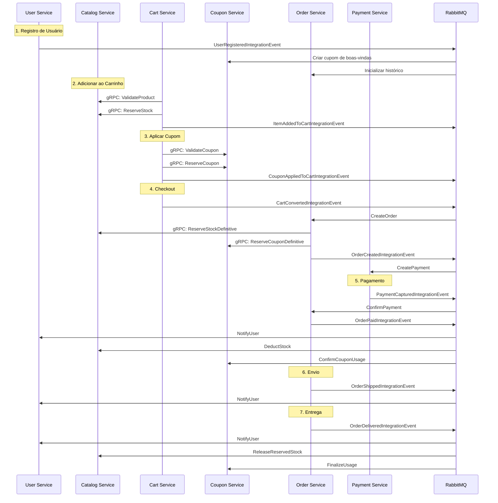

# Commands, Queries, Events e Event Handlers

## E-commerce Microservices Architecture

---

## 📋 Índice

1. [User Service](#1-user-service)
2. [Catalog Service](#2-catalog-service)
3. [Cart Service](#3-cart-service)
4. [Order Service](#4-order-service)
5. [Payment Service](#5-payment-service)
6. [Coupon Service](#6-coupon-service)
7. [Fluxo de Eventos Cross-Service](#7-fluxo-de-eventos-cross-service)

---

## 1. User Service

### 📝 Commands

#### 1.1 RegisterUserCommand

**Responsabilidade:** Registrar novo usuário no sistema

```csharp
// Input
- Email
- Password
- FirstName
- LastName
- PhoneNumber (opcional)

// Validações
- Email único
- Senha forte (8+ chars, maiúscula, número, especial)
- Formato de email válido

// Side Effects
- Cria registro em AspNetUsers
- Cria UserProfile
- Envia email de confirmação
- Publica UserRegisteredIntegrationEvent (RabbitMQ)
```

#### 1.2 UpdateProfileCommand

**Responsabilidade:** Atualizar dados do perfil do usuário

```csharp
// Input
- UserId
- FirstName
- LastName
- DisplayName
- BirthDate
- Gender
- CPF
- PreferredLanguage
- PreferredCurrency

// Validações
- CPF único e válido
- Formato de CPF (XXX.XXX.XXX-XX)
- Data de nascimento válida

// Side Effects
- Atualiza user_profiles
- Incrementa version (optimistic locking)
- Publica ProfileUpdatedIntegrationEvent (RabbitMQ)
```

#### 1.3 AddAddressCommand

**Responsabilidade:** Adicionar endereço ao usuário

```csharp
// Input
- UserId
- Label (Casa, Trabalho, etc)
- RecipientName
- Street, Number, Complement
- Neighborhood, City, State
- PostalCode
- IsDefault
- IsBillingAddress

// Validações
- CEP válido
- Estado brasileiro válido (sigla 2 letras)
- Apenas 1 endereço default por usuário

// Side Effects
- Cria registro em addresses
- Se IsDefault=true, remove default dos outros
- Publica AddressAddedIntegrationEvent (RabbitMQ)
```

#### 1.4 UpdateAddressCommand

**Responsabilidade:** Atualizar endereço existente

```csharp
// Input
- AddressId
- UserId
- [Campos do endereço]

// Validações
- Endereço pertence ao usuário
- Mesmas validações do AddAddressCommand

// Side Effects
- Atualiza addresses
- Publica AddressUpdatedIntegrationEvent (RabbitMQ)
```

#### 1.5 DeleteAddressCommand

**Responsabilidade:** Soft delete de endereço

```csharp
// Input
- AddressId
- UserId

// Validações
- Endereço pertence ao usuário
- Não é o único endereço default

// Side Effects
- Soft delete (deleted_at)
- Se era default, promove outro
- Publica AddressDeletedIntegrationEvent (RabbitMQ)
```

#### 1.6 AddFavoriteProductCommand

**Responsabilidade:** Adicionar produto aos favoritos

```csharp
// Input
- UserId
- ProductId
- ProductSnapshot (JSON)

// Validações
- Produto não está nos favoritos
- ProductId existe (via gRPC com Catalog Service)

// Side Effects
- Cria user_favorite_products
- Publica FavoriteProductAddedIntegrationEvent (RabbitMQ)
```

#### 1.7 RemoveFavoriteProductCommand

**Responsabilidade:** Remover produto dos favoritos

```csharp
// Input
- UserId
- ProductId

// Validações
- Produto está nos favoritos

// Side Effects
- Remove de user_favorite_products
- Publica FavoriteProductRemovedIntegrationEvent (RabbitMQ)
```

#### 1.8 UpdateNotificationPreferencesCommand

**Responsabilidade:** Atualizar preferências de notificação

```csharp
// Input
- UserId
- EmailEnabled
- PushEnabled
- SmsEnabled
- OrderUpdates, Promotions, PriceDrops, etc.

// Side Effects
- Atualiza/cria user_notification_preferences
- Publica NotificationPreferencesUpdatedIntegrationEvent (RabbitMQ)
```

#### 1.9 MarkNotificationAsReadCommand

**Responsabilidade:** Marcar notificação como lida

```csharp
// Input
- NotificationId
- UserId

// Validações
- Notificação pertence ao usuário

// Side Effects
- Atualiza read_at em user_notifications
- Não publica evento
```

#### 1.10 RevokeSessionCommand

**Responsabilidade:** Revogar sessão/dispositivo

```csharp
// Input
- SessionId
- UserId
- RevokedReason

// Validações
- Sessão pertence ao usuário

// Side Effects
- Atualiza revoked_at em user_sessions
- Publica SessionRevokedIntegrationEvent (RabbitMQ)
```

---

### 🔍 Queries

#### 1.1 GetUserProfileQuery

```csharp
// Input: UserId
// Output: UserProfileDto (dados completos do perfil)
// Fonte: user_profiles JOIN AspNetUsers
```

#### 1.2 GetUserAddressesQuery

```csharp
// Input: UserId
// Output: List<AddressDto>
// Fonte: addresses WHERE user_id = X AND deleted_at IS NULL
```

#### 1.3 GetUserFavoriteProductsQuery

```csharp
// Input: UserId, PageNumber, PageSize
// Output: PagedResult<FavoriteProductDto>
// Fonte: user_favorite_products
// Nota: Pode fazer gRPC call ao Catalog para dados atualizados
```

#### 1.4 GetUserNotificationsQuery

```csharp
// Input: UserId, UnreadOnly, PageNumber, PageSize
// Output: PagedResult<NotificationDto>
// Fonte: user_notifications
```

#### 1.5 GetUserSessionsQuery

```csharp
// Input: UserId
// Output: List<UserSessionDto>
// Fonte: user_sessions WHERE revoked_at IS NULL
```

#### 1.6 GetUserLoginHistoryQuery

```csharp
// Input: UserId, PageNumber, PageSize
// Output: PagedResult<LoginHistoryDto>
// Fonte: user_login_history
```

#### 1.7 GetNotificationPreferencesQuery

```csharp
// Input: UserId
// Output: NotificationPreferencesDto
// Fonte: user_notification_preferences
```

---

### 📤 Domain Events

#### 1.1 UserRegisteredDomainEvent

```csharp
// Triggered: Após criação de User + Profile
// Handled Internally:
//   - Criar preferências default de notificação
//   - Enviar email de boas-vindas
```

#### 1.2 ProfileUpdatedDomainEvent

```csharp
// Triggered: Após update de UserProfile
// Handled Internally:
//   - Audit log
```

#### 1.3 AddressAddedDomainEvent

```csharp
// Triggered: Após criação de Address
// Handled Internally:
//   - Atualizar contagem de endereços no cache
```

---

### 🌐 Integration Events (RabbitMQ)

#### Publicados (Outbox Pattern)

##### 1.1 UserRegisteredIntegrationEvent

```csharp
// Exchange: user.events
// Routing Key: user.registered
// Payload:
{
  "UserId": "uuid",
  "Email": "string",
  "FirstName": "string",
  "LastName": "string",
  "RegisteredAt": "datetime"
}

// Consumidores:
// - Order Service: Preparar histórico de pedidos
// - Coupon Service: Enviar cupom de primeira compra
// - Marketing Service: Adicionar à lista de email
```

##### 1.2 ProfileUpdatedIntegrationEvent

```csharp
// Exchange: user.events
// Routing Key: user.profile.updated
// Payload:
{
  "UserId": "uuid",
  "UpdatedFields": ["FirstName", "CPF"],
  "UpdatedAt": "datetime"
}

// Consumidores:
// - Order Service: Atualizar cache de dados do usuário
```

##### 1.3 AddressAddedIntegrationEvent

```csharp
// Exchange: user.events
// Routing Key: user.address.added
// Payload:
{
  "UserId": "uuid",
  "AddressId": "uuid",
  "IsDefault": "bool",
  "PostalCode": "string"
}

// Consumidores:
// - Order Service: Disponibilizar para seleção no checkout
```

##### 1.4 FavoriteProductAddedIntegrationEvent

```csharp
// Exchange: user.events
// Routing Key: user.favorite.added
// Payload:
{
  "UserId": "uuid",
  "ProductId": "uuid",
  "AddedAt": "datetime"
}

// Consumidores:
// - Catalog Service: Incrementar contador de favoritos
// - Notification Service: Ativar alertas de preço
```

#### Consumidos (Inbox Pattern)

##### 1.1 ProductPriceDroppedIntegrationEvent

```csharp
// Handler: NotifyUserOfPriceDropHandler
// Ação: Criar notificação in-app e enviar email se configurado
// Fonte: Catalog Service
```

##### 1.2 ProductBackInStockIntegrationEvent

```csharp
// Handler: NotifyUserOfStockHandler
// Ação: Criar notificação in-app
// Fonte: Catalog Service
```

##### 1.3 OrderStatusChangedIntegrationEvent

```csharp
// Handler: NotifyUserOfOrderStatusHandler
// Ação: Criar notificação in-app
// Fonte: Order Service
```

---

## 2. Catalog Service

### 📝 Commands

#### 2.1 CreateCategoryCommand

**Responsabilidade:** Criar nova categoria

```csharp
// Input
- Name
- ParentId (opcional)
- Description
- ImageUrl
- MetaTitle, MetaDescription
- SortOrder

// Validações
- Nome único dentro do parent
- Parent existe (se fornecido)
- Depth máximo 5 níveis

// Side Effects
- Cria categoria
- Calcula path materializado
- Gera slug automaticamente
- Publica CategoryCreatedIntegrationEvent (RabbitMQ)
```

#### 2.2 CreateProductCommand

**Responsabilidade:** Criar novo produto

```csharp
// Input
- CategoryId
- SKU (único)
- Name
- ShortDescription, Description
- Price, CompareAtPrice, CostPrice
- Stock, LowStockThreshold
- Weight, Dimensions
- Attributes (JSON)
- Tags[]

// Validações
- SKU único
- Categoria existe
- Preço > 0
- CompareAtPrice > Price (se fornecido)

// Side Effects
- Cria produto (status DRAFT)
- Gera slug
- Publica ProductCreatedIntegrationEvent (RabbitMQ)
```

#### 2.3 UpdateProductCommand

**Responsabilidade:** Atualizar produto existente

```csharp
// Input
- ProductId
- [Campos editáveis]

// Validações
- Produto existe
- SKU único (se alterado)

// Side Effects
- Atualiza produto
- Incrementa version
- Se preço mudou: ProductPriceChangedIntegrationEvent (RabbitMQ)
- Se status mudou: ProductStatusChangedIntegrationEvent (RabbitMQ)
```

#### 2.4 UpdateStockCommand

**Responsabilidade:** Ajuste manual de estoque

```csharp
// Input
- ProductId
- NewStock
- Reason (string)
- PerformedBy (UserId)

// Validações
- Produto existe
- NewStock >= ReservedStock

// Side Effects
- Atualiza stock em products
- Cria registro em stock_movements (ADJUSTMENT)
- Se ficou < LowStockThreshold: LowStockIntegrationEvent (RabbitMQ)
- Se ficou = 0: OutOfStockIntegrationEvent (RabbitMQ)
```

#### 2.5 ReserveStockCommand

**Responsabilidade:** Reservar estoque para carrinho/pedido

```csharp
// Input
- ProductId
- Quantity
- ReferenceType (CART/ORDER)
- ReferenceId
- ExpiresAt

// Validações
- Produto existe
- Stock disponível >= Quantity
- Não há reserva duplicada

// Side Effects
- Atualiza reserved_stock em products
- Cria stock_reservations
- Cria stock_movements (RESERVE)
- Não publica evento (operação interna)
```

#### 2.6 ReleaseStockCommand

**Responsabilidade:** Liberar reserva de estoque

```csharp
// Input
- ReservationId (ou ProductId + ReferenceType + ReferenceId)

// Validações
- Reserva existe

// Side Effects
- Atualiza reserved_stock em products
- Marca released_at em stock_reservations
- Cria stock_movements (RELEASE)
- Não publica evento
```

#### 2.7 AddProductImageCommand

**Responsabilidade:** Adicionar imagem ao produto

```csharp
// Input
- ProductId
- ImageFile (IFormFile)
- AltText
- IsPrimary

// Validações
- Produto existe
- Formato de imagem válido
- Tamanho máximo (5MB)

// Side Effects
- Upload para storage (S3/Azure Blob)
- Gera thumbnails (CDN)
- Cria product_images
- Se IsPrimary: remove primary das outras
```

#### 2.8 CreateProductReviewCommand

**Responsabilidade:** Criar avaliação de produto

```csharp
// Input
- ProductId
- UserId
- OrderId (opcional, para verified purchase)
- Rating (1-5)
- Title
- Comment

// Validações
- Produto existe
- Usuário não avaliou este produto antes
- Se OrderId fornecido: usuário comprou produto

// Side Effects
- Cria product_reviews (is_approved = false)
- Publica ProductReviewCreatedIntegrationEvent (RabbitMQ)
```

#### 2.9 ApproveReviewCommand

**Responsabilidade:** Aprovar avaliação (admin)

```csharp
// Input
- ReviewId
- ApprovedBy (UserId)

// Side Effects
- Atualiza is_approved = true
- Refresh materialized view mv_product_stats
- Publica ProductReviewApprovedIntegrationEvent (RabbitMQ)
```

#### 2.10 PublishProductCommand

**Responsabilidade:** Publicar produto (DRAFT → ACTIVE)

```csharp
// Input
- ProductId

// Validações
- Produto existe
- Status = DRAFT
- Tem pelo menos 1 imagem
- Preço configurado
- Categoria ativa

// Side Effects
- Atualiza status = ACTIVE
- Define published_at
- Publica ProductPublishedIntegrationEvent (RabbitMQ)
```

---

### 🔍 Queries

#### 2.1 GetProductByIdQuery

```csharp
// Input: ProductId
// Output: ProductDetailDto (com imagens, reviews, avg rating)
// Fonte: products JOIN product_images JOIN mv_product_stats
```

#### 2.2 GetProductsQuery

```csharp
// Input: CategoryId?, Status?, IsFeatured?, PageNumber, PageSize
// Output: PagedResult<ProductDto>
// Fonte: products (com filtros)
```

#### 2.3 SearchProductsQuery

```csharp
// Input: SearchTerm, CategoryId?, PriceMin?, PriceMax?, PageNumber, PageSize
// Output: PagedResult<ProductDto>
// Fonte: products (full-text search com pg_trgm)
```

#### 2.4 GetCategoriesQuery

```csharp
// Input: ParentId? (null = root categories)
// Output: List<CategoryDto>
// Fonte: categories (hierárquico)
```

#### 2.5 GetProductReviewsQuery

```csharp
// Input: ProductId, IsApproved?, PageNumber, PageSize
// Output: PagedResult<ProductReviewDto>
// Fonte: product_reviews
```

#### 2.6 GetProductStockQuery

```csharp
// Input: ProductId
// Output: StockDto (available, reserved, total)
// Fonte: products
```

#### 2.7 GetStockMovementsQuery

```csharp
// Input: ProductId, DateFrom?, DateTo?, PageNumber, PageSize
// Output: PagedResult<StockMovementDto>
// Fonte: stock_movements
```

#### 2.8 GetLowStockProductsQuery

```csharp
// Input: Threshold?
// Output: List<ProductDto>
// Fonte: products WHERE stock <= low_stock_threshold
```

---

### 📤 Domain Events

#### 2.1 ProductCreatedDomainEvent

```csharp
// Triggered: Após criação de Product
// Handled Internally: Audit log
```

#### 2.2 StockChangedDomainEvent

```csharp
// Triggered: Após qualquer mudança em stock
// Handled Internally:
//   - Verificar low stock
//   - Verificar out of stock
```

#### 2.3 PriceChangedDomainEvent

```csharp
// Triggered: Após mudança de preço
// Handled Internally:
//   - Verificar se é price drop (< preço anterior)
//   - Se sim, preparar notificação para usuários com produto favorito
```

---

### 🌐 Integration Events (RabbitMQ)

#### Publicados

##### 2.1 ProductCreatedIntegrationEvent

```csharp
// Exchange: catalog.events
// Routing Key: catalog.product.created
// Payload:
{
  "ProductId": "uuid",
  "SKU": "string",
  "Name": "string",
  "CategoryId": "uuid",
  "Price": "decimal",
  "CreatedAt": "datetime"
}

// Consumidores: Nenhum (informativo)
```

##### 2.2 ProductPriceChangedIntegrationEvent

```csharp
// Exchange: catalog.events
// Routing Key: catalog.product.price.changed
// Payload:
{
  "ProductId": "uuid",
  "OldPrice": "decimal",
  "NewPrice": "decimal",
  "ChangedAt": "datetime"
}

// Consumidores:
// - Cart Service: Atualizar current_price em cart_items
```

##### 2.3 ProductPriceDroppedIntegrationEvent

```csharp
// Exchange: catalog.events
// Routing Key: catalog.product.price.dropped
// Payload:
{
  "ProductId": "uuid",
  "OldPrice": "decimal",
  "NewPrice": "decimal",
  "DiscountPercentage": "decimal"
}

// Consumidores:
// - User Service: Notificar usuários que favoritaram
```

##### 2.4 ProductOutOfStockIntegrationEvent

```csharp
// Exchange: catalog.events
// Routing Key: catalog.product.outofstock
// Payload:
{
  "ProductId": "uuid",
  "SKU": "string",
  "Name": "string"
}

// Consumidores:
// - Cart Service: Marcar item como indisponível
// - Order Service: Cancelar pedidos pendentes
```

##### 2.5 ProductBackInStockIntegrationEvent

```csharp
// Exchange: catalog.events
// Routing Key: catalog.product.backinstock
// Payload:
{
  "ProductId": "uuid",
  "Stock": "int"
}

// Consumidores:
// - User Service: Notificar usuários que favoritaram
// - Cart Service: Reativar item nos carrinhos
```

##### 2.6 LowStockIntegrationEvent

```csharp
// Exchange: catalog.events
// Routing Key: catalog.product.lowstock
// Payload:
{
  "ProductId": "uuid",
  "CurrentStock": "int",
  "Threshold": "int"
}

// Consumidores:
// - Notification Service (Admin): Alertar para reposição
```

#### Consumidos

##### 2.1 OrderCreatedIntegrationEvent

```csharp
// Handler: DeductStockOnOrderCreatedHandler
// Ação:
//   - Deduzir stock (OUT)
//   - Manter reserved_stock
//   - Criar stock_movements
// Fonte: Order Service
```

##### 2.2 OrderCancelledIntegrationEvent

```csharp
// Handler: RestoreStockOnOrderCancelledHandler
// Ação:
//   - Restaurar stock
//   - Reduzir reserved_stock
//   - Criar stock_movements (IN)
// Fonte: Order Service
```

##### 2.3 FavoriteProductAddedIntegrationEvent

```csharp
// Handler: IncrementFavoriteCountHandler (opcional)
// Ação: Incrementar contador interno de favoritos
// Fonte: User Service
```

---

## 3. Cart Service

### 📝 Commands

#### 3.1 CreateCartCommand

**Responsabilidade:** Criar carrinho (usuário logado ou anônimo)

```csharp
// Input
- UserId (opcional)
- SessionId (obrigatório se UserId null)
- IpAddress
- UserAgent

// Validações
- UserId OU SessionId deve existir
- Não pode ter carrinho ativo duplicado

// Side Effects
- Cria carts (status ACTIVE)
- Define expires_at (7 dias)
- Não publica evento (operação interna)
```

#### 3.2 AddItemToCartCommand

**Responsabilidade:** Adicionar produto ao carrinho

```csharp
// Input
- CartId (ou UserId/SessionId para auto-criar)
- ProductId
- Quantity

// Validações
- Produto existe (gRPC call ao Catalog)
- Stock disponível >= Quantity
- Quantity > 0

// Side Effects
- Cria/atualiza cart_items
- Busca dados do produto (snapshot)
- Atualiza updated_at do cart
- Cria cart_activity_log (ADD_ITEM)
- Reserva stock via gRPC ao Catalog
- Publica ItemAddedToCartIntegrationEvent (RabbitMQ)
```

#### 3.3 UpdateItemQuantityCommand

**Responsabilidade:** Atualizar quantidade de item

```csharp
// Input
- CartItemId
- NewQuantity

// Validações
- Item existe
- NewQuantity > 0
- Stock disponível

// Side Effects
- Atualiza quantity em cart_items
- Atualiza updated_at do cart
- Ajusta reserva de stock (gRPC)
- Cria cart_activity_log (UPDATE_QUANTITY)
- Publica CartItemQuantityUpdatedIntegrationEvent (RabbitMQ)
```

#### 3.4 RemoveItemFromCartCommand

**Responsabilidade:** Remover item do carrinho

```csharp
// Input
- CartItemId

// Side Effects
- Soft delete: removed_at em cart_items
- Libera reserva de stock (gRPC)
- Atualiza updated_at do cart
- Cria cart_activity_log (REMOVE_ITEM)
- Publica ItemRemovedFromCartIntegrationEvent (RabbitMQ)
```

#### 3.5 ApplyCouponToCartCommand

**Responsabilidade:** Aplicar cupom ao carrinho

```csharp
// Input
- CartId
- CouponCode

// Validações
- Cupom válido (gRPC call ao Coupon Service)
- Carrinho atende requisitos (valor mínimo, etc.)

// Side Effects
- Atualiza coupon_id, coupon_code, discount_amount em carts
- Atualiza updated_at
- Cria cart_activity_log (APPLY_COUPON)
- Reserva cupom via gRPC ao Coupon Service
- Publica CouponAppliedToCartIntegrationEvent (RabbitMQ)
```

#### 3.6 RemoveCouponFromCartCommand

**Responsabilidade:** Remover cupom do carrinho

```csharp
// Input
- CartId

// Side Effects
- Limpa coupon_id, coupon_code, discount_amount
- Libera reserva de cupom (gRPC)
- Atualiza updated_at
- Cria cart_activity_log (REMOVE_COUPON)
```

#### 3.7 MergeCartsCommand

**Responsabilidade:** Mesclar carrinho anônimo com carrinho de usuário logado

```csharp
// Input
- AnonymousSessionId
- UserId

// Validações
- Carrinho anônimo existe
- Usuário existe

// Side Effects
- Transfere itens únicos do carrinho anônimo
- Soma quantidades de itens duplicados
- Marca carrinho anônimo como MERGED
- Atualiza/cria carrinho do usuário
- Publica CartsMergedIntegrationEvent (RabbitMQ)
```

#### 3.8 ConvertCartToOrderCommand

**Responsabilidade:** Converter carrinho em pedido

```csharp
// Input
- CartId

// Validações
- Carrinho ativo
- Tem itens
- Todos os produtos disponíveis

// Side Effects
- Atualiza status = CONVERTED
- Define converted_at
- Publica CartConvertedIntegrationEvent (RabbitMQ)
// Nota: Order Service cria o pedido ao consumir este evento
```

#### 3.9 ClearCartCommand

**Responsabilidade:** Limpar todos os itens do carrinho

```csharp
// Input
- CartId

// Side Effects
- Soft delete de todos cart_items
- Libera todas as reservas de stock
- Remove cupom se houver
```

---

### 🔍 Queries

#### 3.1 GetCartQuery

```csharp
// Input: CartId (ou UserId/SessionId)
// Output: CartDto (com items, totais, cupom aplicado)
// Fonte: carts JOIN cart_items (WHERE removed_at IS NULL)
// Nota: Pode fazer gRPC ao Catalog para preços atualizados
```

#### 3.2 GetCartItemsQuery

```csharp
// Input: CartId
// Output: List<CartItemDto>
// Fonte: cart_items WHERE removed_at IS NULL
```

#### 3.3 GetAbandonedCartsQuery

```csharp
// Input: MinutesInactive, PageNumber, PageSize
// Output: PagedResult<CartDto>
// Fonte: carts WHERE status='ACTIVE' AND updated_at < NOW() - INTERVAL
// Uso: Background job para remarketing
```

#### 3.4 GetCartActivityLogQuery

```csharp
// Input: CartId
// Output: List<CartActivityDto>
// Fonte: cart_activity_log
// Uso: Analytics e debugging
```

---

### 📤 Domain Events

#### 3.1 CartCreatedDomainEvent

```csharp
// Triggered: Após criação de Cart
// Handled Internally: Audit log
```

#### 3.2 ItemAddedToCartDomainEvent

```csharp
// Triggered: Após adicionar item
// Handled Internally:
//   - Verificar se carrinho estava abandonado
//   - Resetar timer de expiração
```

---

### 🌐 Integration Events (RabbitMQ)

#### Publicados

##### 3.1 ItemAddedToCartIntegrationEvent

```csharp
// Exchange: cart.events
// Routing Key: cart.item.added
// Payload:
{
  "CartId": "uuid",
  "UserId": "uuid?",
  "ProductId": "uuid",
  "Quantity": "int",
  "AddedAt": "datetime"
}

// Consumidores:
// - Analytics Service: Tracking de comportamento
```

##### 3.2 CartAbandonedIntegrationEvent

```csharp
// Exchange: cart.events
// Routing Key: cart.abandoned
// Payload:
{
  "CartId": "uuid",
  "UserId": "uuid?",
  "SessionId": "string?",
  "ItemCount": "int",
  "CartValue": "decimal",
  "LastActivity": "datetime"
}

// Consumidores:
// - Marketing Service: Email de carrinho abandonado
// - Analytics Service: Métricas de abandono
```

##### 3.3 CartConvertedIntegrationEvent

```csharp
// Exchange: cart.events
// Routing Key: cart.converted
// Payload:
{
  "CartId": "uuid",
  "UserId": "uuid",
  "Items": [
    {
      "ProductId": "uuid",
      "Quantity": "int",
      "UnitPrice": "decimal",
      "ProductSnapshot": {}
    }
  ],
  "Subtotal": "decimal",
  "CouponCode": "string?",
  "DiscountAmount": "decimal",
  "ConvertedAt": "datetime"
}

// Consumidores:
// - Order Service: Criar pedido
```

##### 3.4 CouponAppliedToCartIntegrationEvent

```csharp
// Exchange: cart.events
// Routing Key: cart.coupon.applied
// Payload:
{
  "CartId": "uuid",
  "CouponId": "uuid",
  "CouponCode": "string",
  "DiscountAmount": "decimal"
}

// Consumidores: Analytics
```

#### Consumidos

##### 3.1 ProductPriceChangedIntegrationEvent

```csharp
// Handler: UpdateCartItemPriceHandler
// Ação:
//   - Atualizar current_price em cart_items
//   - Marcar price_changed_at
//   - Recalcular totais do carrinho
// Fonte: Catalog Service
```

##### 3.2 ProductOutOfStockIntegrationEvent

```csharp
// Handler: MarkCartItemUnavailableHandler
// Ação:
//   - Atualizar flag de disponibilidade
//   - Notificar usuário (criar notificação)
// Fonte: Catalog Service
```

##### 3.3 UserRegisteredIntegrationEvent

```csharp
// Handler: MergeAnonymousCartOnUserRegisteredHandler
// Ação:
//   - Se usuário tinha carrinho anônimo (via SessionId), mesclar
// Fonte: User Service
```

---

## 4. Order Service

### 📝 Commands

#### 4.1 CreateOrderCommand

**Responsabilidade:** Criar pedido a partir do carrinho

```csharp
// Input
- UserId
- CartId
- ShippingAddressId
- BillingAddressId (opcional)
- ShippingMethod
- PaymentMethod

// Validações
- Endereços pertencem ao usuário
- Carrinho ativo com itens
- Stock disponível para todos os itens
- Cupom válido (se aplicado)

// Side Effects
- Cria orders
- Cria order_items (com snapshots)
- Snapshot de endereços e cupom
- Cria order_status_history (null → PENDING)
- Reserva definitiva de stock (gRPC Catalog)
- Reserva definitiva de cupom (gRPC Coupon)
- Publica OrderCreatedIntegrationEvent (RabbitMQ)
```

#### 4.2 ConfirmOrderPaymentCommand

**Responsabilidade:** Confirmar pagamento do pedido

```csharp
// Input
- OrderId
- PaymentId

// Validações
- Pedido existe
- Status = PENDING ou PAYMENT_PROCESSING

// Side Effects
- Atualiza status = PAID
- Define paid_at
- Cria order_status_history
- Publica OrderPaidIntegrationEvent (RabbitMQ)
```

#### 4.3 StartPreparingOrderCommand

**Responsabilidade:** Iniciar preparação do pedido

```csharp
// Input
- OrderId
- PreparedBy (UserId - admin/warehouse)

// Validações
- Pedido existe
- Status = PAID

// Side Effects
- Atualiza status = PREPARING
- Cria order_status_history
- Publica OrderPreparingIntegrationEvent (RabbitMQ)
```

#### 4.4 ShipOrderCommand

**Responsabilidade:** Marcar pedido como enviado

```csharp
// Input
- OrderId
- ShippingCarrier
- TrackingCode
- TrackingUrl
- EstimatedDeliveryAt

// Validações
- Pedido existe
- Status = PREPARING

// Side Effects
- Atualiza status = SHIPPED
- Define shipped_at
- Atualiza dados de rastreamento
- Cria order_status_history
- Publica OrderShippedIntegrationEvent (RabbitMQ)
```

#### 4.5 MarkOrderAsDeliveredCommand

**Responsabilidade:** Marcar pedido como entregue

```csharp
// Input
- OrderId

// Validações
- Pedido existe
- Status = OUT_FOR_DELIVERY ou SHIPPED

// Side Effects
- Atualiza status = DELIVERED
- Define delivered_at
- Cria order_status_history
- Libera reservas de stock (gRPC Catalog)
- Confirma uso de cupom (gRPC Coupon)
- Publica OrderDeliveredIntegrationEvent (RabbitMQ)
```

#### 4.6 CancelOrderCommand

**Responsabilidade:** Cancelar pedido

```csharp
// Input
- OrderId
- CancellationReason
- CancellationNotes
- CancelledBy (UserId)

// Validações
- Pedido existe
- Status permite cancelamento (PENDING, PAYMENT_PROCESSING, PAID, PREPARING)

// Side Effects
- Atualiza status = CANCELLED
- Define cancelled_at e cancellation_reason
- Cria order_status_history
- Libera reservas de stock (gRPC Catalog)
- Libera cupom (gRPC Coupon)
- Se pago: iniciar reembolso (gRPC Payment)
- Publica OrderCancelledIntegrationEvent (RabbitMQ)
```

#### 4.7 RefundOrderCommand

**Responsabilidade:** Processar reembolso do pedido

```csharp
// Input
- OrderId
- RefundAmount
- Reason

// Validações
- Pedido existe
- Status = DELIVERED ou CANCELLED
- RefundAmount <= order.total

// Side Effects
- Cria order_refunds
- Atualiza status = REFUNDED (se refund total)
- Define refunded_at
- Solicita reembolso ao Payment Service (gRPC)
- Publica OrderRefundedIntegrationEvent (RabbitMQ)
```

#### 4.8 AddTrackingEventCommand

**Responsabilidade:** Adicionar evento de rastreamento

```csharp
// Input
- OrderId
- EventCode
- EventDescription
- Location, City, State
- OccurredAt

// Validações
- Pedido existe
- Status = SHIPPED ou OUT_FOR_DELIVERY

// Side Effects
- Cria order_tracking_events
- Publica OrderTrackingUpdatedIntegrationEvent (RabbitMQ)
```

#### 4.9 GenerateInvoiceCommand

**Responsabilidade:** Gerar nota fiscal

```csharp
// Input
- OrderId
- InvoiceNumber
- InvoiceKey
- InvoiceSeries

// Validações
- Pedido existe
- Status = PAID ou posterior
- Não tem invoice já gerada

// Side Effects
- Cria order_invoices
- Gera PDF (serviço externo)
- Publica InvoiceGeneratedIntegrationEvent (RabbitMQ)
```

---

### 🔍 Queries

#### 4.1 GetOrderByIdQuery

```csharp
// Input: OrderId
// Output: OrderDetailDto (completo com items, status history, tracking)
// Fonte: orders JOIN order_items JOIN order_status_history
```

#### 4.2 GetUserOrdersQuery

```csharp
// Input: UserId, Status?, DateFrom?, DateTo?, PageNumber, PageSize
// Output: PagedResult<OrderDto>
// Fonte: orders WHERE user_id = X
```

#### 4.3 GetOrdersByStatusQuery

```csharp
// Input: Status, PageNumber, PageSize
// Output: PagedResult<OrderDto>
// Fonte: orders WHERE status = X
// Uso: Dashboard operacional
```

#### 4.4 GetOrderTrackingQuery

```csharp
// Input: OrderId ou TrackingCode
// Output: OrderTrackingDto (eventos de rastreamento)
// Fonte: order_tracking_events
```

#### 4.5 GetOrderInvoiceQuery

```csharp
// Input: OrderId
// Output: InvoiceDto
// Fonte: order_invoices
```

#### 4.6 GetPendingOrdersQuery

```csharp
// Input: MinutesOld
// Output: List<OrderDto>
// Fonte: orders WHERE status='PENDING' AND created_at < NOW() - INTERVAL
// Uso: Background job para timeout
```

#### 4.7 GetOrdersNeedingPreparationQuery

```csharp
// Input: None
// Output: List<OrderDto>
// Fonte: orders WHERE status='PAID' ORDER BY paid_at ASC
// Uso: Dashboard de warehouse
```

---

### 📤 Domain Events

#### 4.1 OrderCreatedDomainEvent

```csharp
// Triggered: Após criação de Order
// Handled Internally:
//   - Criar entrada inicial no status history
//   - Iniciar timer de timeout de pagamento
```

#### 4.2 OrderStatusChangedDomainEvent

```csharp
// Triggered: Sempre que status muda
// Handled Internally:
//   - Criar registro em order_status_history (via trigger)
//   - Avaliar ações necessárias por status
```

---

### 🌐 Integration Events (RabbitMQ)

#### Publicados

##### 4.1 OrderCreatedIntegrationEvent

```csharp
// Exchange: order.events
// Routing Key: order.created
// Payload:
{
  "OrderId": "uuid",
  "OrderNumber": "string",
  "UserId": "uuid",
  "Items": [
    {
      "ProductId": "uuid",
      "Quantity": "int",
      "UnitPrice": "decimal"
    }
  ],
  "Total": "decimal",
  "CreatedAt": "datetime"
}

// Consumidores:
// - Payment Service: Criar intenção de pagamento
// - Catalog Service: Deduzir stock definitivo
// - Coupon Service: Marcar cupom como usado
// - Analytics Service: Métricas de conversão
```

##### 4.2 OrderPaidIntegrationEvent

```csharp
// Exchange: order.events
// Routing Key: order.paid
// Payload:
{
  "OrderId": "uuid",
  "OrderNumber": "string",
  "UserId": "uuid",
  "Total": "decimal",
  "PaymentId": "uuid",
  "PaidAt": "datetime"
}

// Consumidores:
// - User Service: Notificar usuário (pagamento confirmado)
// - Notification Service: Enviar email de confirmação
// - Fulfillment Service: Adicionar à fila de preparação
```

##### 4.3 OrderShippedIntegrationEvent

```csharp
// Exchange: order.events
// Routing Key: order.shipped
// Payload:
{
  "OrderId": "uuid",
  "OrderNumber": "string",
  "UserId": "uuid",
  "TrackingCode": "string",
  "TrackingUrl": "string",
  "Carrier": "string",
  "ShippedAt": "datetime"
}

// Consumidores:
// - User Service: Notificar usuário (pedido enviado)
// - Notification Service: Email com código de rastreamento
```

##### 4.4 OrderDeliveredIntegrationEvent

```csharp
// Exchange: order.events
// Routing Key: order.delivered
// Payload:
{
  "OrderId": "uuid",
  "UserId": "uuid",
  "DeliveredAt": "datetime"
}

// Consumidores:
// - User Service: Notificar usuário (pedido entregue)
// - Catalog Service: Permitir avaliação de produtos
// - Loyalty Service: Adicionar pontos
```

##### 4.5 OrderCancelledIntegrationEvent

```csharp
// Exchange: order.events
// Routing Key: order.cancelled
// Payload:
{
  "OrderId": "uuid",
  "UserId": "uuid",
  "Items": [
    {
      "ProductId": "uuid",
      "Quantity": "int"
    }
  ],
  "CancellationReason": "enum",
  "CancelledAt": "datetime"
}

// Consumidores:
// - Catalog Service: Restaurar stock
// - Coupon Service: Liberar cupom
// - Payment Service: Processar reembolso (se pago)
// - User Service: Notificar usuário
```

##### 4.6 OrderRefundedIntegrationEvent

```csharp
// Exchange: order.events
// Routing Key: order.refunded
// Payload:
{
  "OrderId": "uuid",
  "UserId": "uuid",
  "RefundAmount": "decimal",
  "RefundedAt": "datetime"
}

// Consumidores:
// - User Service: Notificar usuário
// - Payment Service: Confirmar reembolso
```

#### Consumidos

##### 4.1 CartConvertedIntegrationEvent

```csharp
// Handler: CreateOrderFromCartHandler
// Ação: Executar CreateOrderCommand com dados do carrinho
// Fonte: Cart Service
```

##### 4.2 PaymentCapturedIntegrationEvent

```csharp
// Handler: ConfirmOrderPaymentHandler
// Ação: Executar ConfirmOrderPaymentCommand
// Fonte: Payment Service
```

##### 4.3 PaymentFailedIntegrationEvent

```csharp
// Handler: CancelOrderOnPaymentFailedHandler
// Ação: Executar CancelOrderCommand (reason: PAYMENT_FAILED)
// Fonte: Payment Service
```

##### 4.4 ShippingTrackingUpdateReceivedIntegrationEvent

```csharp
// Handler: AddTrackingEventHandler
// Ação: Executar AddTrackingEventCommand com dados da transportadora
// Fonte: Shipping Service (externo via webhook)
```

---

## 5. Payment Service

### 📝 Commands

#### 5.1 CreatePaymentCommand

**Responsabilidade:** Criar novo pagamento

```csharp
// Input
- OrderId
- UserId
- Amount
- PaymentMethodType (CREDIT_CARD, PIX, BOLETO, etc.)
- SavedPaymentMethodId (opcional)
- PaymentMethodData (se não salvou)
- Installments

// Validações
- Order existe e está PENDING
- Amount corresponde ao total do pedido
- Payment method válido

// Side Effects
- Cria payments (status PENDING)
- Gera idempotency_key
- Se PIX: gera QR Code (gateway)
- Se BOLETO: gera boleto (gateway)
- Se CARD: autoriza (gateway)
- Atualiza gateway_transaction_id
- Publica PaymentCreatedIntegrationEvent (RabbitMQ)
```

#### 5.2 CapturePaymentCommand

**Responsabilidade:** Capturar pagamento autorizado

```csharp
// Input
- PaymentId

// Validações
- Payment existe
- Status = AUTHORIZED

// Side Effects
- Captura no gateway
- Atualiza status = CAPTURED
- Define captured_at
- Cria payment_transactions (CAPTURE)
- Publica PaymentCapturedIntegrationEvent (RabbitMQ)
```

#### 5.3 RefundPaymentCommand

**Responsabilidade:** Reembolsar pagamento

```csharp
// Input
- PaymentId
- RefundAmount
- Reason

// Validações
- Payment existe
- Status = CAPTURED
- RefundAmount <= amount - refunds já feitos

// Side Effects
- Processa refund no gateway
- Cria payment_refunds
- Cria payment_transactions (REFUND)
- Atualiza status (REFUNDED ou PARTIALLY_REFUNDED)
- Define refunded_at
- Publica PaymentRefundedIntegrationEvent (RabbitMQ)
```

#### 5.4 ProcessWebhookCommand

**Responsabilidade:** Processar webhook do gateway

```csharp
// Input
- GatewayName
- EventType
- Payload (JSON)
- Headers (JSON)

// Validações
- Assinatura válida
- Gateway conhecido

// Side Effects
- Cria payment_webhooks
- Identifica payment relacionado
- Atualiza status conforme evento
- Marca webhook como processado
- Publica evento correspondente (ex: PaymentCapturedIntegrationEvent)
```

#### 5.5 SavePaymentMethodCommand

**Responsabilidade:** Salvar método de pagamento do usuário

```csharp
// Input
- UserId
- PaymentMethodType
- GatewayPaymentMethodId (token)
- CardData (last4, brand, expiration)
- IsDefault

// Validações
- User existe
- Gateway payment method válido

// Side Effects
- Cria user_payment_methods
- Se IsDefault: remove default dos outros
- Não publica evento
```

#### 5.6 DeletePaymentMethodCommand

**Responsabilidade:** Remover método de pagamento salvo

```csharp
// Input
- PaymentMethodId
- UserId

// Validações
- Payment method pertence ao usuário

// Side Effects
- Soft delete (deleted_at)
- Remove do gateway (se aplicável)
```

#### 5.7 HandleChargebackCommand

**Responsabilidade:** Processar contestação (chargeback)

```csharp
// Input
- PaymentId
- GatewayChargebackId
- ReasonCode
- Amount

// Side Effects
- Cria payment_chargebacks
- Atualiza payment status = CHARGEBACK
- Publica PaymentChargebackIntegrationEvent (RabbitMQ)
```

---

### 🔍 Queries

#### 5.1 GetPaymentByIdQuery

```csharp
// Input: PaymentId
// Output: PaymentDetailDto (com transactions, refunds)
// Fonte: payments JOIN payment_transactions JOIN payment_refunds
```

#### 5.2 GetPaymentsByOrderIdQuery

```csharp
// Input: OrderId
// Output: List<PaymentDto>
// Fonte: payments WHERE order_id = X
```

#### 5.3 GetUserPaymentMethodsQuery

```csharp
// Input: UserId
// Output: List<PaymentMethodDto>
// Fonte: user_payment_methods WHERE deleted_at IS NULL
```

#### 5.4 GetPendingPaymentsQuery

```csharp
// Input: MinutesOld
// Output: List<PaymentDto>
// Fonte: payments WHERE status='PENDING' AND created_at < NOW() - INTERVAL
// Uso: Background job para expirar PIX/Boleto
```

#### 5.5 GetPaymentMetricsQuery

```csharp
// Input: DateFrom, DateTo, GroupBy (day/hour)
// Output: PaymentMetricsDto (total, successful, failed, by method)
// Fonte: v_payment_metrics (view)
```

---

### 📤 Domain Events

#### 5.1 PaymentCreatedDomainEvent

```csharp
// Triggered: Após criação de Payment
// Handled Internally:
//   - Se PIX/Boleto: iniciar timer de expiração
```

#### 5.2 PaymentCapturedDomainEvent

```csharp
// Triggered: Após captura
// Handled Internally: Audit log
```

---

### 🌐 Integration Events (RabbitMQ)

#### Publicados

##### 5.1 PaymentCreatedIntegrationEvent

```csharp
// Exchange: payment.events
// Routing Key: payment.created
// Payload:
{
  "PaymentId": "uuid",
  "OrderId": "uuid",
  "Amount": "decimal",
  "PaymentMethodType": "enum",
  "Status": "enum",
  "CreatedAt": "datetime"
}

// Consumidores:
// - Order Service: Atualizar status para PAYMENT_PROCESSING
```

##### 5.2 PaymentCapturedIntegrationEvent

```csharp
// Exchange: payment.events
// Routing Key: payment.captured
// Payload:
{
  "PaymentId": "uuid",
  "OrderId": "uuid",
  "Amount": "decimal",
  "CapturedAt": "datetime"
}

// Consumidores:
// - Order Service: Confirmar pagamento (status PAID)
// - Analytics Service: Métricas de conversão
```

##### 5.3 PaymentFailedIntegrationEvent

```csharp
// Exchange: payment.events
// Routing Key: payment.failed
// Payload:
{
  "PaymentId": "uuid",
  "OrderId": "uuid",
  "ErrorCode": "string",
  "ErrorMessage": "string",
  "FailedAt": "datetime"
}

// Consumidores:
// - Order Service: Cancelar pedido
// - User Service: Notificar usuário
```

##### 5.4 PaymentRefundedIntegrationEvent

```csharp
// Exchange: payment.events
// Routing Key: payment.refunded
// Payload:
{
  "PaymentId": "uuid",
  "OrderId": "uuid",
  "RefundAmount": "decimal",
  "RefundedAt": "datetime"
}

// Consumidores:
// - Order Service: Confirmar reembolso
// - User Service: Notificar usuário
```

##### 5.5 PaymentChargebackIntegrationEvent

```csharp
// Exchange: payment.events
// Routing Key: payment.chargeback
// Payload:
{
  "PaymentId": "uuid",
  "OrderId": "uuid",
  "ChargebackAmount": "decimal",
  "ReasonCode": "string"
}

// Consumidores:
// - Order Service: Marcar pedido como disputado
// - Fraud Service: Analisar padrões
// - Notification Service: Alertar admin
```

#### Consumidos

##### 5.1 OrderCreatedIntegrationEvent

```csharp
// Handler: CreatePaymentIntentHandler
// Ação: Preparar intenção de pagamento (se auto-capture)
// Fonte: Order Service
```

##### 5.2 OrderCancelledIntegrationEvent

```csharp
// Handler: CancelPaymentOnOrderCancelledHandler
// Ação:
//   - Se AUTHORIZED: fazer void
//   - Se CAPTURED: iniciar refund
// Fonte: Order Service
```

---

## 6. Coupon Service

### 📝 Commands

#### 6.1 CreateCouponCommand

**Responsabilidade:** Criar novo cupom

```csharp
// Input
- Code (único)
- Name
- Description
- DiscountType (PERCENTAGE, FIXED_AMOUNT, FREE_SHIPPING, BUY_X_GET_Y)
- DiscountValue
- MaxDiscountAmount (para percentuais)
- Scope (ALL, CATEGORIES, PRODUCTS, FIRST_PURCHASE, SPECIFIC_USERS)
- MinPurchaseAmount
- ValidFrom, ValidUntil
- MaxUses, MaxUsesPerUser
- IsStackable
- CreatedBy (admin UserId)

// Validações
- Code único
- DiscountValue > 0
- Se PERCENTAGE: value <= 100
- ValidUntil > ValidFrom
- Se BUY_X_GET_Y: buyQuantity e getQuantity obrigatórios

// Side Effects
- Cria coupons (status DRAFT)
- Publica CouponCreatedIntegrationEvent (RabbitMQ)
```

#### 6.2 UpdateCouponCommand

**Responsabilidade:** Atualizar cupom existente

```csharp
// Input
- CouponId
- [Campos editáveis]

// Validações
- Cupom existe
- Não pode alterar code se já teve uso
- Não pode reduzir max_uses abaixo de current_uses

// Side Effects
- Atualiza coupons
- Incrementa version
- Publica CouponUpdatedIntegrationEvent (RabbitMQ)
```

#### 6.3 ActivateCouponCommand

**Responsabilidade:** Ativar cupom (DRAFT/SCHEDULED → ACTIVE)

```csharp
// Input
- CouponId

// Validações
- Cupom existe
- Status = DRAFT ou SCHEDULED
- ValidFrom <= NOW

// Side Effects
- Atualiza status = ACTIVE
- Publica CouponActivatedIntegrationEvent (RabbitMQ)
```

#### 6.4 DeactivateCouponCommand

**Responsabilidade:** Desativar cupom

```csharp
// Input
- CouponId

// Validações
- Cupom existe
- Status = ACTIVE

// Side Effects
- Atualiza status = PAUSED
- Libera todas as reservas
- Publica CouponDeactivatedIntegrationEvent (RabbitMQ)
```

#### 6.5 ValidateCouponCommand

**Responsabilidade:** Validar se cupom pode ser usado

```csharp
// Input
- CouponCode
- UserId
- CartSubtotal
- CartItems[] (para validar scope)

// Validações
- Todas as regras via validate_coupon_usage()
- Verifica scope (categories, products, users)

// Output
- IsValid
- ErrorCode/Message
- DiscountAmount calculado

// Side Effects
- Não altera dados (query-like command)
```

#### 6.6 ReserveCouponCommand

**Responsabilidade:** Reservar cupom durante checkout

```csharp
// Input
- CouponId
- CartId
- UserId
- DiscountAmount
- ExpiresAt (15 minutos)

// Validações
- Cupom válido (ValidateCouponCommand)
- Não há reserva duplicada

// Side Effects
- Cria coupon_reservations
- Não incrementa current_uses ainda
- Não publica evento
```

#### 6.7 ReleaseCouponReservationCommand

**Responsabilidade:** Liberar reserva (carrinho abandonado/expirado)

```csharp
// Input
- ReservationId (ou CouponId + CartId)

// Side Effects
- Marca released_at em coupon_reservations
```

#### 6.8 ConfirmCouponUsageCommand

**Responsabilidade:** Confirmar uso (pedido criado)

```csharp
// Input
- CouponId
- UserId
- OrderId
- DiscountAmount
- OrderSubtotal

// Validações
- Há reserva ativa para este cupom+cart

// Side Effects
- Cria coupon_usages
- Incrementa current_uses em coupons (via trigger)
- Marca reserva como converted_at
- Se atingiu max_uses: status = DEPLETED (via trigger)
- Publica CouponUsedIntegrationEvent (RabbitMQ)
```

#### 6.9 AddEligibleCategoriesCommand

**Responsabilidade:** Adicionar categorias ao cupom (scope=CATEGORIES)

```csharp
// Input
- CouponId
- CategoryIds[]

// Side Effects
- Cria coupon_eligible_categories (bulk)
```

#### 6.10 AddEligibleProductsCommand

**Responsabilidade:** Adicionar produtos ao cupom (scope=PRODUCTS)

```csharp
// Input
- CouponId
- ProductIds[]

// Side Effects
- Cria coupon_eligible_products (bulk)
```

#### 6.11 AddEligibleUsersCommand

**Responsabilidade:** Adicionar usuários ao cupom (scope=SPECIFIC_USERS)

```csharp
// Input
- CouponId
- UserIds[]

// Side Effects
- Cria coupon_eligible_users (bulk)
```

---

### 🔍 Queries

#### 6.1 GetCouponByCodeQuery

```csharp
// Input: Code
// Output: CouponDto (completo com regras)
// Fonte: coupons
```

#### 6.2 GetCouponByIdQuery

```csharp
// Input: CouponId
// Output: CouponDetailDto (com eligible entities, usage stats)
// Fonte: coupons + JOINs
```

#### 6.3 GetActiveCouponsQuery

```csharp
// Input: PageNumber, PageSize
// Output: PagedResult<CouponDto>
// Fonte: v_active_coupons (view)
```

#### 6.4 GetUserCouponsQuery

```csharp
// Input: UserId
// Output: List<CouponDto> (cupons que o usuário pode usar)
// Fonte: coupons WHERE scope=ALL OR user in eligible_users
```

#### 6.5 GetCouponUsagesQuery

```csharp
// Input: CouponId, PageNumber, PageSize
// Output: PagedResult<CouponUsageDto>
// Fonte: coupon_usages
```

#### 6.6 GetCouponMetricsQuery

```csharp
// Input: CouponId
// Output: CouponMetricsDto
// Fonte: v_coupon_metrics (view)
```

#### 6.7 GetExpiringCouponsQuery

```csharp
// Input: DaysUntilExpiration
// Output: List<CouponDto>
// Fonte: v_expiring_coupons (view)
// Uso: Background job para notificar usuários
```

---

### 📤 Domain Events

#### 6.1 CouponCreatedDomainEvent

```csharp
// Triggered: Após criação de Coupon
// Handled Internally: Audit log
```

#### 6.2 CouponUsedDomainEvent

```csharp
// Triggered: Após confirmar uso
// Handled Internally:
//   - Verificar se atingiu limite (handled by trigger)
```

---

### 🌐 Integration Events (RabbitMQ)

#### Publicados

##### 6.1 CouponCreatedIntegrationEvent

```csharp
// Exchange: coupon.events
// Routing Key: coupon.created
// Payload:
{
  "CouponId": "uuid",
  "Code": "string",
  "DiscountType": "enum",
  "ValidFrom": "datetime",
  "ValidUntil": "datetime"
}

// Consumidores:
// - Marketing Service: Enviar email promocional
```

##### 6.2 CouponActivatedIntegrationEvent

```csharp
// Exchange: coupon.events
// Routing Key: coupon.activated
// Payload:
{
  "CouponId": "uuid",
  "Code": "string",
  "ActivatedAt": "datetime"
}

// Consumidores:
// - User Service: Notificar usuários elegíveis (se SPECIFIC_USERS)
// - Marketing Service: Campanha de divulgação
```

##### 6.3 CouponUsedIntegrationEvent

```csharp
// Exchange: coupon.events
// Routing Key: coupon.used
// Payload:
{
  "CouponId": "uuid",
  "Code": "string",
  "UserId": "uuid",
  "OrderId": "uuid",
  "DiscountAmount": "decimal",
  "UsedAt": "datetime"
}

// Consumidores:
// - Analytics Service: Métricas de conversão de cupons
```

##### 6.4 CouponExpiredIntegrationEvent

```csharp
// Exchange: coupon.events
// Routing Key: coupon.expired
// Payload:
{
  "CouponId": "uuid",
  "Code": "string",
  "ExpiredAt": "datetime"
}

// Consumidores:
// - Cart Service: Remover cupom dos carrinhos
// - Notification Service: Alertar admin
```

##### 6.5 CouponDepletedIntegrationEvent

```csharp
// Exchange: coupon.events
// Routing Key: coupon.depleted
// Payload:
{
  "CouponId": "uuid",
  "Code": "string",
  "DepletedAt": "datetime"
}

// Consumidores:
// - Cart Service: Remover cupom dos carrinhos
// - Marketing Service: Pausar campanhas
```

#### Consumidos

##### 6.1 OrderCreatedIntegrationEvent

```csharp
// Handler: ConfirmCouponUsageHandler
// Ação: Executar ConfirmCouponUsageCommand
// Fonte: Order Service
```

##### 6.2 OrderCancelledIntegrationEvent

```csharp
// Handler: ReleaseCouponOnOrderCancelledHandler
// Ação:
//   - Decrementar current_uses em coupons
//   - Criar registro reverso em coupon_usages (negativo)
// Fonte: Order Service
```

##### 6.3 UserRegisteredIntegrationEvent

```csharp
// Handler: CreateFirstPurchaseCouponHandler
// Ação: Criar cupom exclusivo de boas-vindas
// Fonte: User Service
```

---

## 7. Fluxo de Eventos Cross-Service

### 🔄 Fluxo Completo: Registro → Compra → Entrega



---

## 📊 Resumo por Serviço

### User Service

- **Commands**: 10
- **Queries**: 7
- **Domain Events**: 3
- **Integration Events Publicados**: 4
- **Integration Events Consumidos**: 3
- **Comunicação RabbitMQ**: ✅ Sim
- **Comunicação gRPC**: ❌ Não (é consultado, não consulta)

### Catalog Service

- **Commands**: 10
- **Queries**: 8
- **Domain Events**: 3
- **Integration Events Publicados**: 6
- **Integration Events Consumidos**: 3
- **Comunicação RabbitMQ**: ✅ Sim
- **Comunicação gRPC**: ✅ Sim (recebe chamadas de Cart, Order)

### Cart Service

- **Commands**: 9
- **Queries**: 4
- **Domain Events**: 2
- **Integration Events Publicados**: 4
- **Integration Events Consumidos**: 3
- **Comunicação RabbitMQ**: ✅ Sim
- **Comunicação gRPC**: ✅ Sim (chama Catalog, Coupon)

### Order Service

- **Commands**: 9
- **Queries**: 7
- **Domain Events**: 2
- **Integration Events Publicados**: 6
- **Integration Events Consumidos**: 4
- **Comunicação RabbitMQ**: ✅ Sim
- **Comunicação gRPC**: ✅ Sim (chama Catalog, Coupon, Payment)

### Payment Service

- **Commands**: 7
- **Queries**: 5
- **Domain Events**: 2
- **Integration Events Publicados**: 5
- **Integration Events Consumidos**: 2
- **Comunicação RabbitMQ**: ✅ Sim
- **Comunicação gRPC**: ✅ Sim (recebe chamadas de Order)

### Coupon Service

- **Commands**: 11
- **Queries**: 7
- **Domain Events**: 2
- **Integration Events Publicados**: 5
- **Integration Events Consumidos**: 3
- **Comunicação RabbitMQ**: ✅ Sim
- **Comunicação gRPC**: ✅ Sim (recebe chamadas de Cart, Order)

---

## 🎯 Total Geral

| Categoria                          | Total |
| ---------------------------------- | ----- |
| **Commands**                       | 56    |
| **Queries**                        | 38    |
| **Domain Events**                  | 14    |
| **Integration Events Publicados**  | 30    |
| **Integration Events Consumidos**  | 18    |
| **Handlers de Integration Events** | 18    |

---

## 📝 Observações Importantes

### Padrões de Comunicação

1. **RabbitMQ (Assíncrono)**

   - Usado para: eventos de negócio, notificações, integrações não-críticas
   - Pattern: Outbox (garantia de entrega)
   - Pattern: Inbox (idempotência)
   - Exchanges por serviço: `user.events`, `catalog.events`, etc.

2. **gRPC (Síncrono)**
   - Usado para: validações em tempo real, consultas de dados
   - Exemplos:
     - Cart → Catalog: verificar stock, obter dados de produto
     - Cart → Coupon: validar cupom
     - Order → Catalog: reservar stock definitivo
     - Order → Payment: criar pagamento

### Garantias de Consistência

- **Eventual Consistency**: Entre serviços via RabbitMQ
- **Strong Consistency**: Dentro do mesmo serviço (transações ACID)
- **Optimistic Locking**: Campo `version` em entidades críticas
- **Idempotência**: Inbox pattern para evitar processamento duplicado
- **Retries**: Outbox pattern com retry_count

### Background Jobs Necessários

1. **User Service**

   - Limpar sessões expiradas
   - Limpar notificações antigas

2. **Catalog Service**

   - Limpar reservas de stock expiradas
   - Refresh materialized views (mv_product_stats)
   - Verificar produtos com low stock

3. **Cart Service**

   - Detectar carrinhos abandonados (remarketing)
   - Limpar carrinhos expirados
   - Sincronizar preços com Catalog

4. **Order Service**

   - Timeout de pedidos pendentes (15-30 min)
   - Atualizar tracking de envios
   - Limpar dados antigos

5. **Payment Service**

   - Expirar PIX/Boleto não pagos
   - Processar webhooks com retry

6. **Coupon Service**
   - Ativar cupons agendados
   - Expirar cupons vencidos
   - Limpar reservas expiradas
   - Notificar cupons próximos de expirar

---

## 🔐 Considerações de Segurança

### Commands

- Todos os commands devem validar ownership (userId)
- Commands administrativos requerem roles específicas
- Validação de input em todos os commands

### Events

- Integration Events não devem conter dados sensíveis (senhas, tokens)
- Payloads devem ser mínimos (somente IDs e dados essenciais)
- Assinatura de eventos para verificar origem

### Queries

- Sempre filtrar por userId ou validar permissões
- Paginação obrigatória para evitar DoS
- Rate limiting em queries pesadas

---

## 🚀 Priorização de Implementação

### Fase 1 - MVP (Core)

1. User Service: Register, Login, Profile
2. Catalog Service: Products, Categories, Stock
3. Cart Service: Add/Remove Items
4. Order Service: Create Order, Basic Status
5. Payment Service: Credit Card básico

### Fase 2 - Essencial

1. Coupon Service: Cupons básicos
2. Notificações de pedido
3. Favoritos
4. Histórico de pedidos

### Fase 3 - Completo

1. PIX e Boleto
2. Avaliações de produtos
3. Tracking detalhado
4. Analytics completo
5. Admin dashboards

---

_Este documento é um guia vivo e deve ser atualizado conforme a evolução do projeto._
